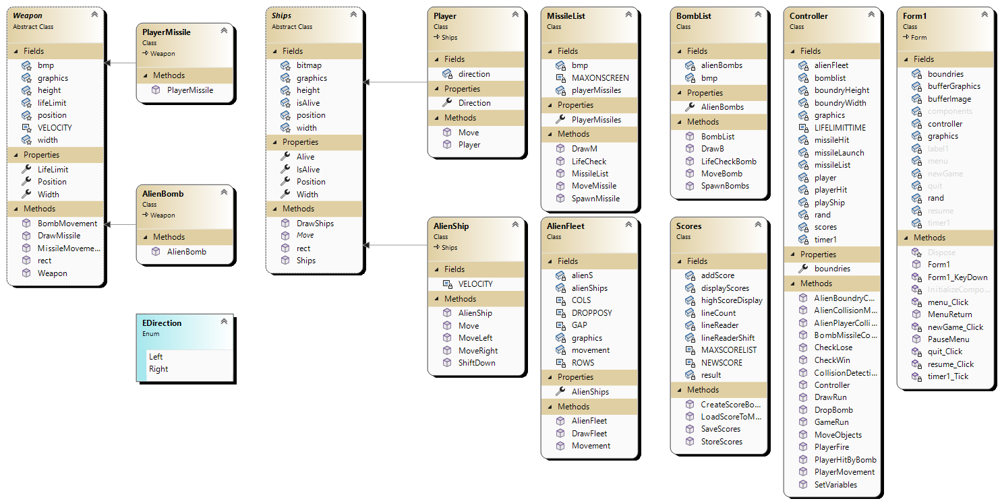

# Diagram
 

 
Game may behave differently on a laptop screen compared to monitor

# References
 
Getting screen size
 
https://stackoverflow.com/questions/5082610/get-and-set-screen-resolution
 
 
https://learn.microsoft.com/en-us/dotnet/api/system.windows.forms.screen?redirectedfrom=MSDN&view=windowsdesktop-6.0
 
 
https://learn.microsoft.com/en-us/dotnet/api/system.windows.forms.screen.primaryscreen?redirectedfrom=MSDN&view=windowsdesktop-6.0#System_Windows_Forms_Screen_PrimaryScreen
 
 
https://learn.microsoft.com/en-us/dotnet/api/system.windows.forms.screen.bounds?redirectedfrom=MSDN&view=windowsdesktop-6.0#System_Windows_Forms_Screen_Bounds
 
 
Audio Used:
 
https://undertale-resources.tumblr.com/categories
 
# MISC
 
I could have kept weapon/bomb/missiles together with the Ship class as one whole class
 
but decided to seperate because it was easier for me to get where I needed, even though it's using the same code which we don't want.
